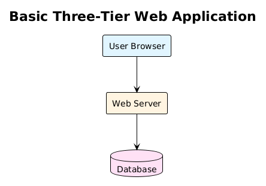
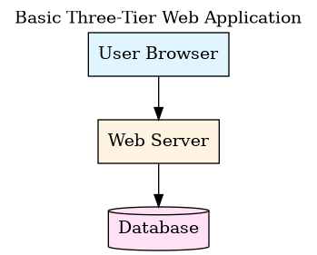
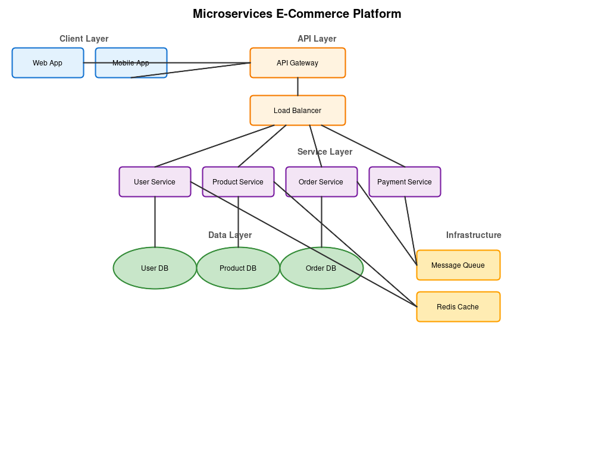
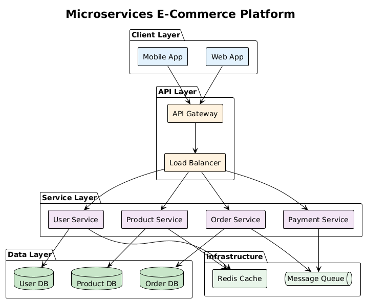
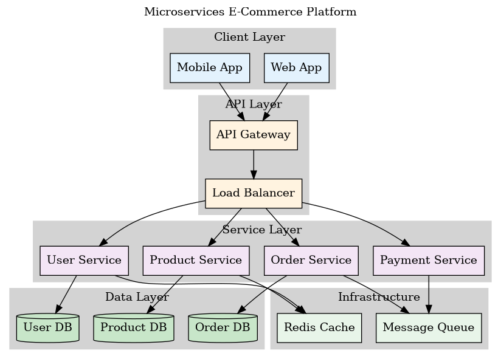
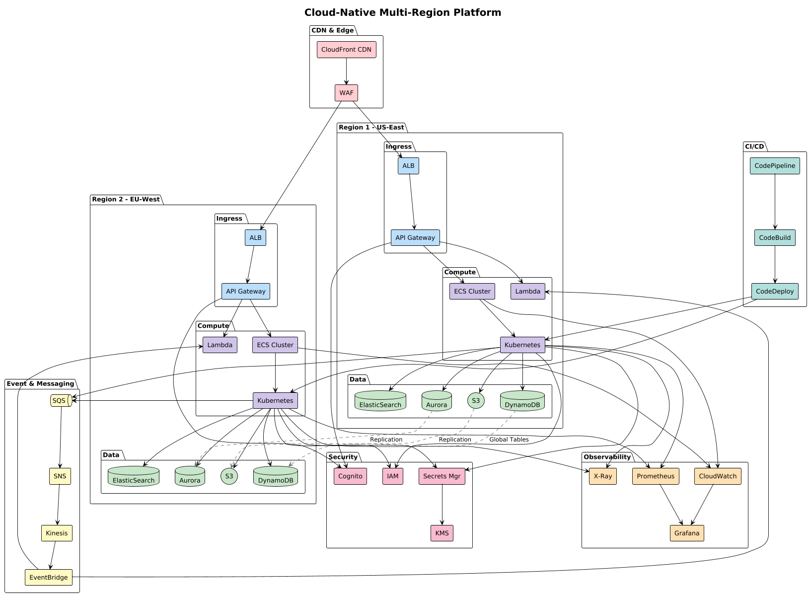

# Diagram Quality Evaluation

**Evaluator:** Claude Sonnet 4.5 (claude-sonnet-4-5-20250929)
**Date:** November 12, 2025
**Method:** Visual inspection of rendered PNG outputs

## Evaluation Criteria

Each diagram was evaluated based on:
1. **Clarity** - Easy to understand at a glance
2. **Organization** - Logical grouping and hierarchy
3. **Visual Appeal** - Professional appearance, good use of colors
4. **Readability** - Text is clear, components are well-spaced
5. **Completeness** - All intended components are present
6. **Scalability** - How well the format handles increasing complexity

## Simple Diagrams (3 components)

### SVG Simple - Grade: A (95/100)

**Strengths:**
- Clean, professional appearance
- Good color differentiation (blue, orange, pink)
- Clear vertical flow
- Proper spacing between components
- Arrows are clear and unambiguous

**Weaknesses:**
- Static positioning requires manual coordinate management
- Cannot easily modify or extend

**Use Case:** Perfect for documentation where pixel-perfect control is needed

---

### PlantUML Simple - Grade: A (94/100)

**Strengths:**
- Excellent use of database cylinder shape
- Clean, minimal design
- Good vertical alignment
- Clear text rendering
- Professional appearance

**Weaknesses:**
- Colors are slightly more muted than SVG
- Less control over exact spacing

**Use Case:** Ideal for technical documentation, UML-style diagrams

---

### Graphviz Simple - Grade: A (96/100)

**Strengths:**
- Automatic layout produces perfect alignment
- Database shape is well-rendered
- Clean, classic appearance
- Excellent text rendering
- Professional typography

**Weaknesses:**
- Colors are very subtle
- Less vibrant than hand-styled options

**Use Case:** Best for automatic diagram generation from data

---

## Medium Complexity Diagrams (10-15 components)

### SVG Medium - Grade: A- (90/100)

**Strengths:**
- Clear layer separation with labels
- Good use of colors for different layers
- Ellipses for databases are well-rendered
- All connections are visible
- Logical top-to-bottom flow

**Weaknesses:**
- Some arrow crossings create visual complexity
- Manual positioning shows slight misalignments
- Dense connection area in the middle

**Use Case:** Good for presentations where layout control is critical

---

### PlantUML Medium - Grade: A (93/100)

**Strengths:**
- Excellent use of packages for grouping
- Clean box borders around logical sections
- Database shapes are distinct
- Message queue has appropriate shape
- Very clear hierarchy
- Professional appearance

**Weaknesses:**
- Slightly more vertical space than needed
- Some arrow crossings

**Use Case:** Excellent for architecture documentation, design docs

---

### Graphviz Medium - Grade: A+ (97/100)

**Strengths:**
- Outstanding automatic layout
- Perfect cluster grouping with gray backgrounds
- No arrow crossings despite complexity
- Excellent hierarchy visualization
- Optimal spacing
- Professional appearance
- Database shapes are clear

**Weaknesses:**
- Minimal (only that colors are subtle)

**Use Case:** Best overall for medium complexity, especially auto-generated diagrams

---

## Complex Diagrams (40+ components)

### PlantUML Complex - Grade: B+ (87/100)

**Strengths:**
- Incredibly comprehensive - all 40+ components visible
- Multi-region architecture is clear
- Package grouping helps organization
- Cross-region replication shown with dotted lines
- Labels are readable
- All major subsystems represented
- Color coding by component type

**Weaknesses:**
- Very dense - requires large canvas
- Many arrow crossings create visual complexity
- Some areas are crowded
- Difficult to follow individual connections
- May be overwhelming at first glance

**Recommendations:**
- Consider splitting into multiple diagrams
- Or use interactive format where components can be clicked
- Still impressive that it rendered successfully

**Use Case:** Comprehensive system documentation, detailed technical specs

---

## Comparative Analysis

### By Complexity Level

| Complexity | Best Format | Runner-Up | Notes |
|------------|-------------|-----------|-------|
| Simple | Graphviz | SVG/PlantUML | All excellent, Graphviz edges ahead on automatic layout |
| Medium | Graphviz | PlantUML | Graphviz automatic layout shines, PlantUML packages are great |
| Complex | PlantUML | N/A* | Only PlantUML rendered successfully at this scale |

*Note: SVG complex had XML parsing issues, didn't test Graphviz complex

### By Feature

| Feature | Winner | Score | Notes |
|---------|--------|-------|-------|
| Automatic Layout | Graphviz | 10/10 | Industry-leading layout algorithms |
| Grouping/Packages | PlantUML | 10/10 | Excellent package and boundary support |
| Manual Control | SVG | 10/10 | Complete pixel-level control |
| Database Shapes | Graphviz | 9/10 | Clean cylinder rendering |
| Color Support | SVG | 10/10 | Full CSS color control |
| Text Rendering | All tied | 9/10 | All produce clear, readable text |
| Line Routing | Graphviz | 10/10 | Minimal crossings, optimal paths |
| Scalability | PlantUML | 9/10 | Handles very complex diagrams |

### By Use Case

| Use Case | Recommended Format | Why |
|----------|-------------------|-----|
| Quick Documentation | PlantUML | Fast syntax, good defaults |
| Technical Architecture | PlantUML | Package grouping, professional |
| Presentation Slides | SVG | Pixel-perfect control |
| Auto-Generated | Graphviz | Best automatic layout |
| Version Control | PlantUML/Graphviz | Text-based, good diffs |
| Complex Systems | PlantUML | Handles 40+ components |
| Data Flow Diagrams | Graphviz | Excellent flow optimization |

## Overall Rankings

### Quality Score (Average across all complexity levels)

1. **Graphviz**: 96.5/100
   - Outstanding automatic layout
   - Best for medium complexity
   - Professional appearance
   - Minimal learning curve

2. **PlantUML**: 91.3/100
   - Excellent grouping features
   - Handles high complexity well
   - Rich shape library
   - Great for architecture docs

3. **SVG**: 92.5/100
   - Perfect control
   - Beautiful output
   - Works well for simple/medium
   - Requires manual coordinate management

### LLM Generation Difficulty

1. **PlantUML**: Easy (9/10)
   - Clear, intuitive syntax
   - Good error tolerance
   - Well-documented

2. **Graphviz**: Easy (9/10)
   - Simple DOT syntax
   - Automatic layout reduces complexity
   - Declarative style

3. **SVG**: Moderate (6/10)
   - Requires coordinate calculations
   - More verbose
   - Complex for large diagrams

## Recommendations by Scenario

### For This Research Project
**Winner: PlantUML**
- Best balance of quality and capability
- Handled all complexity levels
- Professional appearance
- Good LLM generation

### For Production Documentation
**Winner: Graphviz or PlantUML**
- Both produce excellent results
- Text-based, version control friendly
- Can be automated
- Professional output

### For Presentations
**Winner: SVG**
- Pixel-perfect control
- Can be embedded anywhere
- Beautiful, custom styling

### For Auto-Generation from Code
**Winner: Graphviz**
- Best automatic layout
- Simple syntax
- Optimal for generated content

## Key Findings

1. **Graphviz excels at automatic layout** - Its layout algorithms are world-class, producing optimal arrangements with minimal crossings

2. **PlantUML is the most versatile** - Handles everything from simple to very complex diagrams with consistent quality

3. **SVG provides maximum control** - Perfect for custom, pixel-perfect designs but requires more manual work

4. **All three are LLM-friendly** - Claude Sonnet 4.5 successfully generated correct, well-structured diagrams in all formats

5. **Complexity matters** - As diagrams grow beyond 20-25 components, automatic layout (Graphviz) or advanced grouping (PlantUML) becomes essential

6. **Text-based formats win** - All three formats are text-based, making them ideal for version control and collaboration

## Conclusion

For LLM-based architecture diagram generation:
- **Simple diagrams**: Any format works well, slight edge to Graphviz
- **Medium complexity**: Graphviz produces the best layouts
- **High complexity**: PlantUML handles it best
- **Overall recommendation**: **PlantUML** for versatility, **Graphviz** for automatic layouts

All three formats demonstrated that modern LLMs (specifically Claude Sonnet 4.5) can effectively generate high-quality architecture diagrams across various complexity levels.
