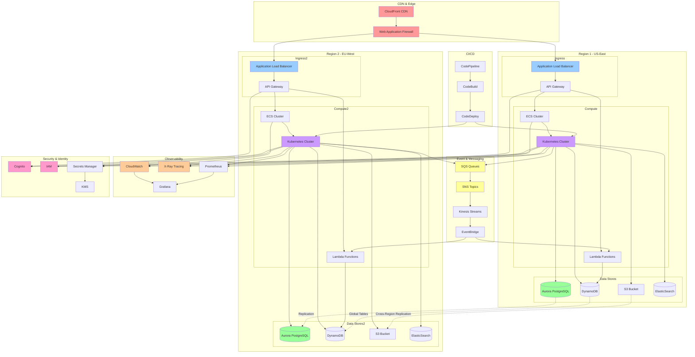

# Complex Architecture - Cloud-Native Multi-Region Platform

**Model Used:** Claude Sonnet 4.5 (claude-sonnet-4-5-20250929)

**Description:** A sophisticated cloud-native platform with multi-region deployment, event-driven architecture, observability, and security components

## Mermaid Diagram

## Explanation

This complex architecture demonstrates:

### Multi-Region Deployment
- Two active regions (US-East and EU-West) for high availability
- Cross-region replication for data stores (Aurora, S3, DynamoDB Global Tables)

### Edge & Security
- CloudFront CDN for global content delivery
- WAF for application security
- Cognito for user authentication
- IAM for access control
- Secrets Manager with KMS for secrets encryption

### Compute Layer
- Multiple compute options: ECS, Lambda, Kubernetes
- Application Load Balancers with API Gateway
- Flexible workload distribution

### Event-Driven Architecture
- SQS for reliable queuing
- SNS for pub/sub messaging
- Kinesis for real-time data streaming
- EventBridge for event routing
- Lambda functions triggered by events

### Data Layer
- Aurora PostgreSQL with cross-region replication
- DynamoDB Global Tables for low-latency access
- S3 with cross-region replication
- ElasticSearch for search and analytics

### Observability
- CloudWatch for monitoring and logging
- X-Ray for distributed tracing
- Prometheus for metrics collection
- Grafana for visualization

### CI/CD Pipeline
- CodePipeline for workflow orchestration
- CodeBuild for building artifacts
- CodeDeploy for automated deployments to both regions

This architecture supports:
- High availability and disaster recovery
- Global scalability
- Security best practices
- Comprehensive monitoring and observability
- Automated deployment processes
