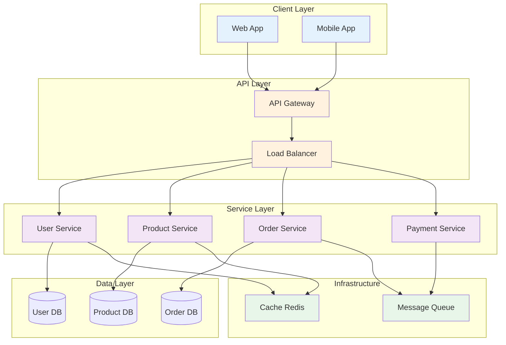

# Medium Complexity - Microservices E-Commerce Platform

**Model Used:** Claude Sonnet 4.5 (claude-sonnet-4-5-20250929)

**Description:** A microservices-based e-commerce platform with API gateway, multiple services, and message queue

## Mermaid Diagram

## Explanation
- Multiple client types (web and mobile)
- API Gateway pattern with load balancing
- Four microservices: User, Product, Order, Payment
- Each service has its own database (database per service pattern)
- Message queue for asynchronous communication
- Redis cache for performance optimization
