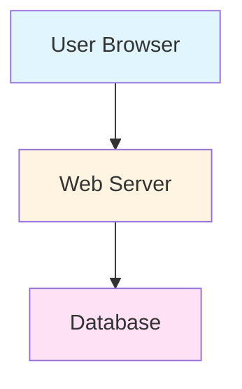

# Simple Architecture Diagram - Basic Web Application

**Model Used:** Claude Sonnet 4.5 (claude-sonnet-4-5-20250929)

**Description:** A basic three-tier web application architecture

## Mermaid Diagram

## Explanation
- Simple three-tier architecture
- User interface connects to web server
- Web server connects to database
- Color-coded for visual clarity
